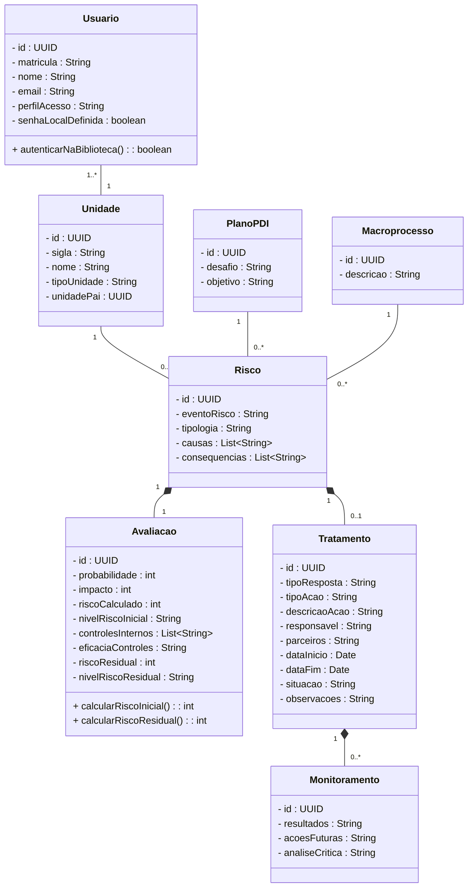

##  Diagrama UML


# Título do repositório

Descrição curta do repositório.

## Sumário

* [Pré-requisitos](#pré-requisitos)
* [Instalação](#instalação)
* [Instruções de uso](#instruções-de-uso)
* [Contato](#contato)
* [Bibliografia](#bibliografia)

## Pré-requisitos

Descreva aqui brevemente os pré-requisitos necessários para executar o código-fonte. Descreva também
a configuração mínima da máquina em que o código foi desenvolvido, e se alguma configuração em particular é essencial
para sua execução (por exemplo, placa de vídeo dedicada):

| Configuração        | Valor                    |
|---------------------|--------------------------|
| Sistema operacional | Windows 10 Pro (64 bits) |
| Processador         | Intel core i7 9700       |
| Memória RAM         | 16GB                     |
| Necessita rede?     | Sim                      |


## Instalação

Descreva aqui as instruções para instalação das ferramentas para execução do código-fonte: 

```bash
sudo apt-get install nano
```

## Instruções de Uso

Descreva aqui o passo-a-passo que outros usuários precisam realizar para conseguir executar com sucesso o código-fonte
deste projeto:

```No PowerShell:
cd D:\repositorios\comandos-fe\app
```

Se ainda não tiver ambiente virtual:
```Se ainda não tiver ambiente virtual:
python -m venv ..\.venv
```

Ativa o ambiente:
```Ativa o ambiente:
..\.venv\Scripts\Activate.ps1
```

Instala as dependências:
```Instala as dependências:
pip install -r requirements.txt
```

Cria o .env:
```Cria o .env:
Copy-Item .env.example .env
```

Roda as migrations:
```Roda as migrations:
python manage.py migrate
```

Sobe o sistema:
```Sobe o sistema:
python manage.py runserver
```

## Testes

Executar os testes:
```Executar os testes<comandos-fe\app> 
.\.venv\Scripts\python.exe -m pytest app\tests -v
```

## Lint (Pylint)

Instalar Pylint:
```Instalar Pylint
.\.venv\Scripts\python.exe -m pip install pylint
```

Executar Pylint:
```Executar Pylint
.\.venv\Scripts\python.exe -m pylint app -f colorized
```
(Última nota do Pylint: 8.59)

## Contato

O repositório foi originalmente desenvolvido por Fulano: [fulano@ufsm.br]()

## Bibliografia

Adicione aqui entradas numa lista com a documentação pertinente:

* [Documentação coplin-db2](https://pypi.org/project/coplin-db2/)
