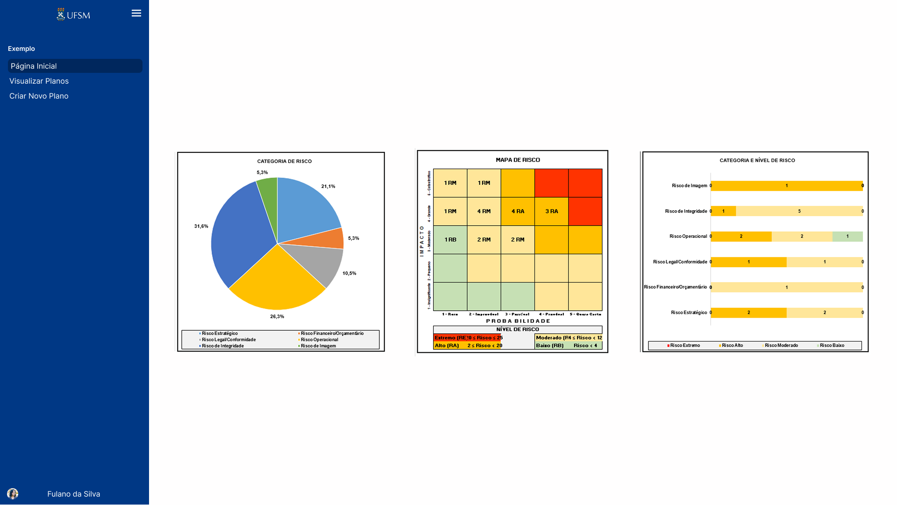
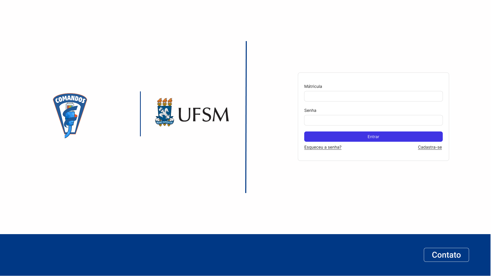
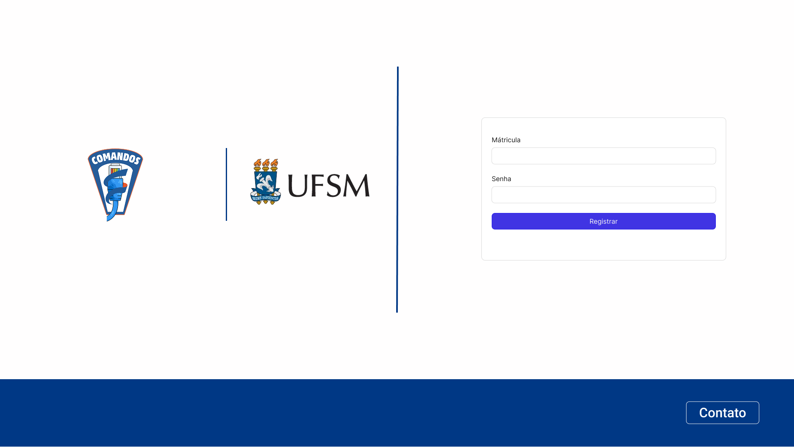
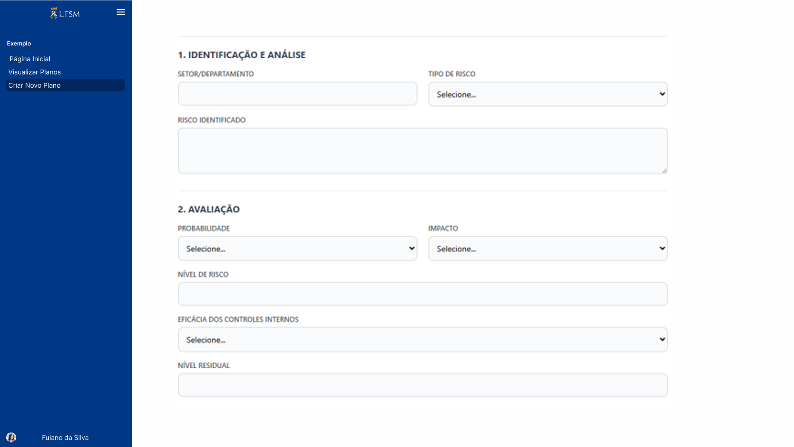
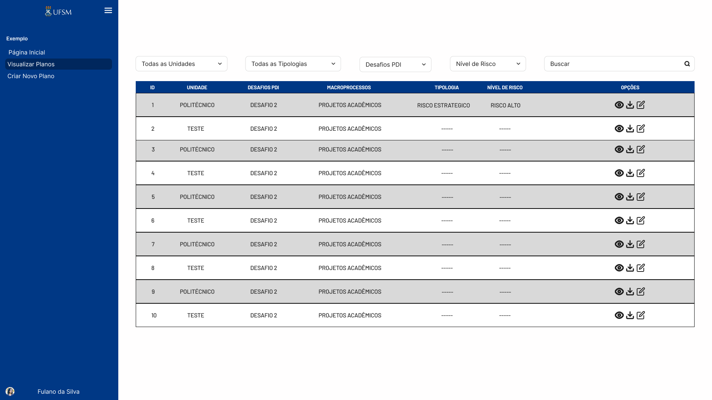

# Telas e Design

A pasta `docs/design/screens/` já existia no projeto e foi reaproveitada na documentação MkDocs.

## Home

## Login

## Registro

## Novo plano

## Visualizar planos

## Observações de design

- As telas documentam o fluxo principal do usuário: autenticar, registrar, acessar a home e manipular planos/riscos.
- A nomenclatura visual usa "planos" em alguns pontos, enquanto o domínio do código usa "riscos" e "análise de riscos". Vale padronizar a linguagem para reduzir ambiguidade.
- Se o projeto for apresentado academicamente, estas imagens ajudam a demonstrar a relação entre protótipo e implementação.

